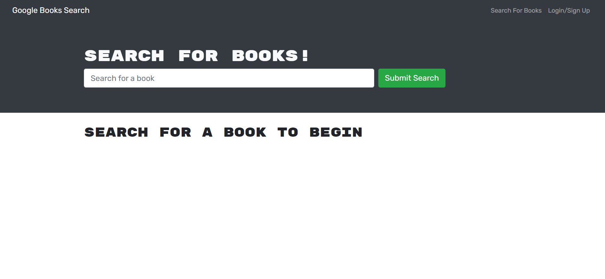
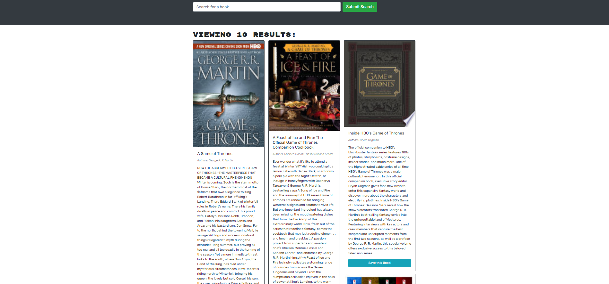
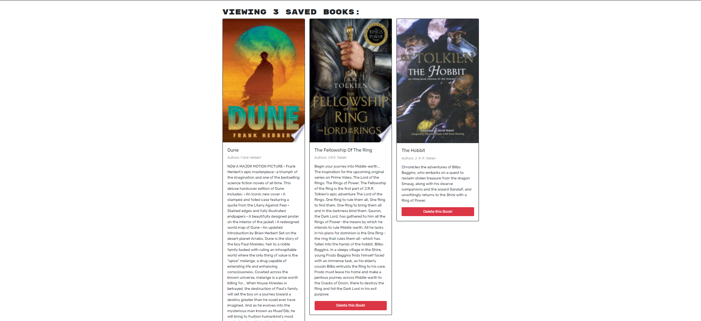

# MERN Stack Book Search Engine


## User Story

```md
AS AN avid reader
I WANT to search for new books to read
SO THAT I can keep a list of books to purchase
```

## Description

A MERN stack search engine that utilizes Google Books API to find and save a user's favorite books. This application utilizes mongoDB for it's database storage, mongoose schemas to create models, and React.js for it's front-end views. Furthermore, the API endpoints were refactored from an original express API endpoint approach to a GraphQL approach. This application also meets the following acceptance criteria:

```md
GIVEN a book search engine
WHEN I load the search engine
THEN I am presented with a menu with the options Search for Books and Login/Signup and an input field to search for books and a submit button
WHEN I click on the Search for Books menu option
THEN I am presented with an input field to search for books and a submit button
WHEN I am not logged in and enter a search term in the input field and click the submit button
THEN I am presented with several search results, each featuring a book’s title, author, description, image, and a link to that book on the Google Books site
WHEN I click on the Login/Signup menu option
THEN a modal appears on the screen with a toggle between the option to log in or sign up
WHEN the toggle is set to Signup
THEN I am presented with three inputs for a username, an email address, and a password, and a signup button
WHEN the toggle is set to Login
THEN I am presented with two inputs for an email address and a password and login button
WHEN I enter a valid email address and create a password and click on the signup button
THEN my user account is created and I am logged in to the site
WHEN I enter my account’s email address and password and click on the login button
THEN I the modal closes and I am logged in to the site
WHEN I am logged in to the site
THEN the menu options change to Search for Books, an option to see my saved books, and Logout
WHEN I am logged in and enter a search term in the input field and click the submit button
THEN I am presented with several search results, each featuring a book’s title, author, description, image, and a link to that book on the Google Books site and a button to save a book to my account
WHEN I click on the Save button on a book
THEN that book’s information is saved to my account
WHEN I click on the option to see my saved books
THEN I am presented with all of the books I have saved to my account, each featuring the book’s title, author, description, image, and a link to that book on the Google Books site and a button to remove a book from my account
WHEN I click on the Remove button on a book
THEN that book is deleted from my saved books list
WHEN I click on the Logout button
THEN I am logged out of the site and presented with a menu with the options Search for Books and Login/Signup and an input field to search for books and a submit button  
```

The landing page looks as follows:



The search page looks as follows:



The saved books page looks as follows:




The following link leads to the application:

// TODO: Add a link to the website

## Table of Contents

- [Installation](#installation)
- [Usage](#usage)
- [Credits](#credits)
- [Contribute](#contribute)
- [Tests](#tests)
- [Questions](#questions)
- [License](#license)

## Installation

MongoDB needs to be installed locally to run this application. Installation documentation can be found at: https://www.mongodb.com/home

Furthermore, the following packages need to be installed in order to run the application:

Apollo Server Express: https://www.npmjs.com/package/apollo-server-express

Bcrypt: https://www.npmjs.com/package/bcrypt

Express: https://www.npmjs.com/package/express

JSON Web Token: https://www.npmjs.com/package/jsonwebtoken

JWT Decode: https://www.npmjs.com/package/jwt-decode

Mongoose: https://mongoosejs.com/

These packages can be installed using the command:

```md
npm run install
```

## Usage

This program can be downloaded and used by anyone. To run the application, use the following commands:

First, follow the installation steps listed above. Once the installation is done, seed and run the application by running the following commands:

```md
npm run develop
```

This will run both the server (an Apollo GraphQL sandbox) and the client (a React application). This product can also be built using:

```md
npm run build
```

## Credits

This following libraries/frameworks/databases are credited with helping create this application:

Apollo Server Express is user for integration of Express into the Apollo Server: https://www.npmjs.com/package/apollo-server-express

Bcrypt is used for hashing passwords: https://www.npmjs.com/package/bcrypt

Bootstrap is a free, open-source CSS framework: https://getbootstrap.com/

Express is used as a web routing framework: https://www.npmjs.com/package/express

GraphQL is an open-source data query and manipulation language for APIs: https://graphql.org/

JSON Web Token is a compact, URL-safe means of representing claims to be transferred between two parties: https://www.npmjs.com/package/jsonwebtoken

JWT Decode is used for decoding JSON Web Tokens: https://www.npmjs.com/package/jwt-decode

MongoDB is a cross-platform document-oriented database program: https://www.mongodb.com/home

Mongoose is used as a javaScript object-oriented library that creates a connection between MongoDB and Node.js: https://mongoosejs.com/

React is a free and open-source frount-end JavaScript library for building user interfaces based on UI components: https://reactjs.org/

## Contribute

This is a completed application and does not need any contributions.

## Tests

There is no testing for this application.

## Questions

Feel free to reach out to me with questions:

Find my GitHub at: [GitHub Profile](https://github.com/cornetj13)

Email me at: cornetj2@gmail.com

## License

This source code is licensed under the MIT license found in the LICENSE file in the root directory of this source tree.
